White Wine Exploration
================
Shariq
9/23/2019

White Wine Exploration by Shariq Shaikh
=======================================

This report explores a dataset containing several attributes for various types of white wines as well as quality rating provided by wine experts. The hope at the end of this analysis is to gain insight into the important factors that determines the quality rating of high and low quality wines.

Univariate Plots Section
========================

    ## 'data.frame':    4898 obs. of  13 variables:
    ##  $ X                   : int  1 2 3 4 5 6 7 8 9 10 ...
    ##  $ fixed.acidity       : num  7 6.3 8.1 7.2 7.2 8.1 6.2 7 6.3 8.1 ...
    ##  $ volatile.acidity    : num  0.27 0.3 0.28 0.23 0.23 0.28 0.32 0.27 0.3 0.22 ...
    ##  $ citric.acid         : num  0.36 0.34 0.4 0.32 0.32 0.4 0.16 0.36 0.34 0.43 ...
    ##  $ residual.sugar      : num  20.7 1.6 6.9 8.5 8.5 6.9 7 20.7 1.6 1.5 ...
    ##  $ chlorides           : num  0.045 0.049 0.05 0.058 0.058 0.05 0.045 0.045 0.049 0.044 ...
    ##  $ free.sulfur.dioxide : num  45 14 30 47 47 30 30 45 14 28 ...
    ##  $ total.sulfur.dioxide: num  170 132 97 186 186 97 136 170 132 129 ...
    ##  $ density             : num  1.001 0.994 0.995 0.996 0.996 ...
    ##  $ pH                  : num  3 3.3 3.26 3.19 3.19 3.26 3.18 3 3.3 3.22 ...
    ##  $ sulphates           : num  0.45 0.49 0.44 0.4 0.4 0.44 0.47 0.45 0.49 0.45 ...
    ##  $ alcohol             : num  8.8 9.5 10.1 9.9 9.9 10.1 9.6 8.8 9.5 11 ...
    ##  $ quality             : int  6 6 6 6 6 6 6 6 6 6 ...

    ##        X        fixed.acidity    volatile.acidity  citric.acid    
    ##  Min.   :   1   Min.   : 3.800   Min.   :0.0800   Min.   :0.0000  
    ##  1st Qu.:1225   1st Qu.: 6.300   1st Qu.:0.2100   1st Qu.:0.2700  
    ##  Median :2450   Median : 6.800   Median :0.2600   Median :0.3200  
    ##  Mean   :2450   Mean   : 6.855   Mean   :0.2782   Mean   :0.3342  
    ##  3rd Qu.:3674   3rd Qu.: 7.300   3rd Qu.:0.3200   3rd Qu.:0.3900  
    ##  Max.   :4898   Max.   :14.200   Max.   :1.1000   Max.   :1.6600  
    ##  residual.sugar     chlorides       free.sulfur.dioxide
    ##  Min.   : 0.600   Min.   :0.00900   Min.   :  2.00     
    ##  1st Qu.: 1.700   1st Qu.:0.03600   1st Qu.: 23.00     
    ##  Median : 5.200   Median :0.04300   Median : 34.00     
    ##  Mean   : 6.391   Mean   :0.04577   Mean   : 35.31     
    ##  3rd Qu.: 9.900   3rd Qu.:0.05000   3rd Qu.: 46.00     
    ##  Max.   :65.800   Max.   :0.34600   Max.   :289.00     
    ##  total.sulfur.dioxide    density             pH          sulphates     
    ##  Min.   :  9.0        Min.   :0.9871   Min.   :2.720   Min.   :0.2200  
    ##  1st Qu.:108.0        1st Qu.:0.9917   1st Qu.:3.090   1st Qu.:0.4100  
    ##  Median :134.0        Median :0.9937   Median :3.180   Median :0.4700  
    ##  Mean   :138.4        Mean   :0.9940   Mean   :3.188   Mean   :0.4898  
    ##  3rd Qu.:167.0        3rd Qu.:0.9961   3rd Qu.:3.280   3rd Qu.:0.5500  
    ##  Max.   :440.0        Max.   :1.0390   Max.   :3.820   Max.   :1.0800  
    ##     alcohol         quality     
    ##  Min.   : 8.00   Min.   :3.000  
    ##  1st Qu.: 9.50   1st Qu.:5.000  
    ##  Median :10.40   Median :6.000  
    ##  Mean   :10.51   Mean   :5.878  
    ##  3rd Qu.:11.40   3rd Qu.:6.000  
    ##  Max.   :14.20   Max.   :9.000

The dataset made up of 12 variables and nearly 5,000 observations. The variable 'X' appears to serve as an index of each wine sample for the dataset's corresponding csv file.

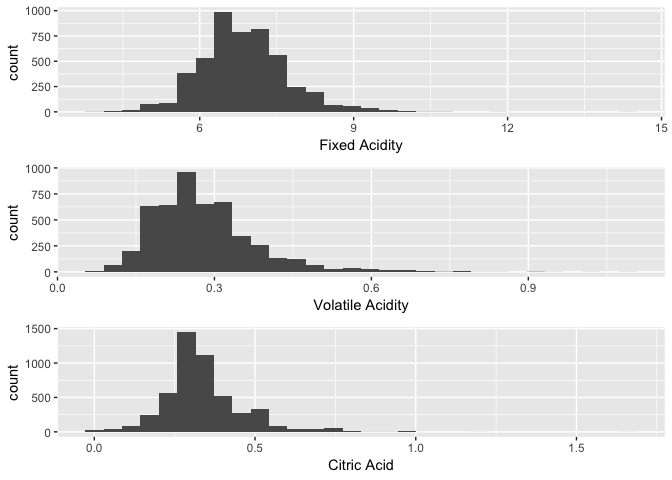

Fixed acidity and volatile acidity are the measurements of tartaric and acetic acid, respectfully, present in the white wines of this dataset. Fixed acidity, volatile acidity and citric acid levels are all measured in grams per decimeter cubed (g/dm^3).

All three types of acid levels are distributed normally for the most part. While volatile acidity and citric acid levels are similar, fixed acidity level are in much larger quantities.

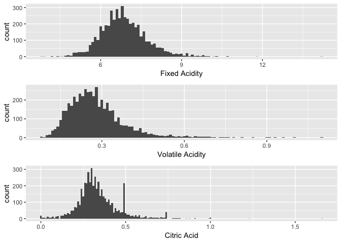

Decreasing the bin size of of each of the plots shows that the normal shape is pretty consistent. The only exception being found is in the plot for citric acid measurments which show an a high number of wines contain .05 g/dm^3 of citric acid which is inconsistent with the normally distributed shape of the plot.

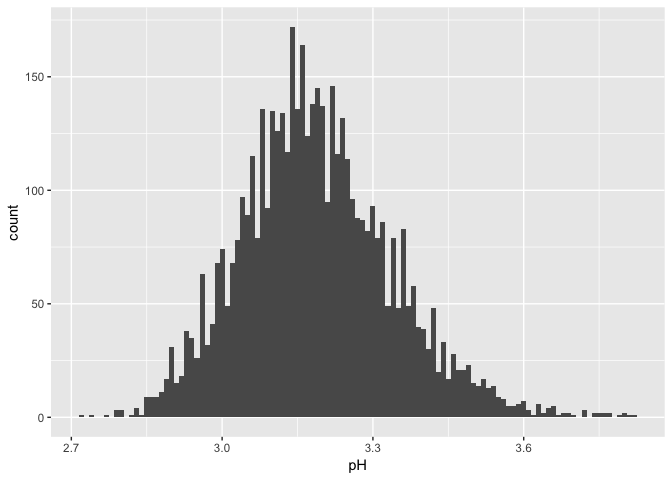

pH describes how acidic or basic a wine is on a scale from 0 (very acidic) to 14 (very basic); most wines are between 3-4 on the pH scale. Based on the samples plotted for this dataset, the ph of most wines for this dataset is around 3.15.

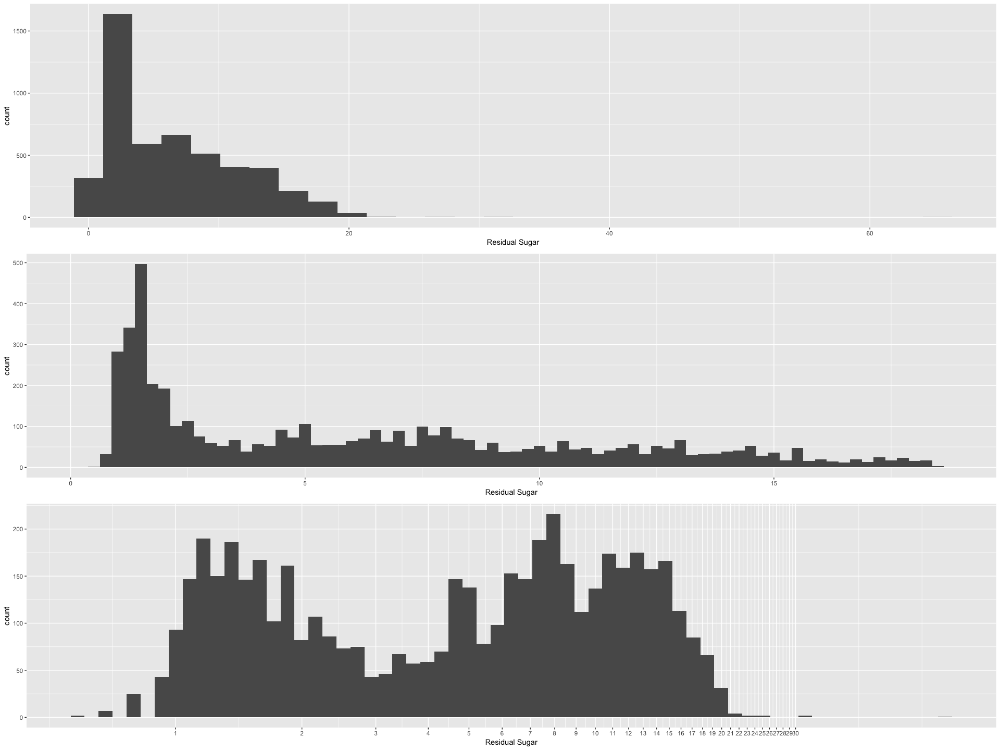

    ##    Min. 1st Qu.  Median    Mean 3rd Qu.    Max. 
    ##   0.600   1.700   5.200   6.391   9.900  65.800

Residual sugar is the amount of sugar remaining after fermentation stops. It's rare to find wines with less than 1 gram/liter and wines with greater than 45 grams/liter are considered sweet. In this dataset residual sugar levels are measured in g/dm^3.

The first of the above three plots is a basic histogram with no alterations. It shows that the data is skewed right with indistinguishable values on the far right. To compensate for this I've modified the plot to only account for the top 99% of values. This is evident in the second plot as the range along the x-axis has been drastically reduced. The issue now is the large counts all the way on the left side of the plot. The noise that is being added from those large counts is making it difficult to take away meaninful insights. To address this I have logarithmically scaled down the x variable to increase the readability of the plot. Here we can now see that with residual sugar levels, the histogram retains a bi-modual shape with levels peaking around 1.2 g/dm^3 and 8g/dm^3.

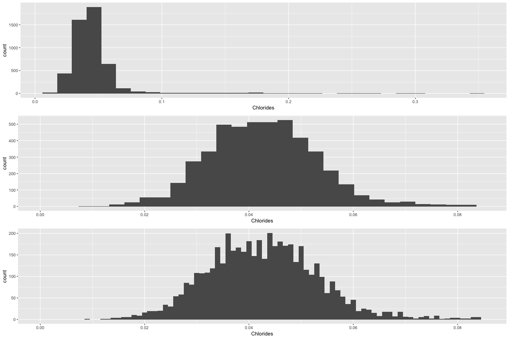

    ##    Min. 1st Qu.  Median    Mean 3rd Qu.    Max. 
    ## 0.00900 0.03600 0.04300 0.04577 0.05000 0.34600

Chlorides is the amount of salt in the wines. In this dataset they are measured in g/dm^3.

A basic histogram shows that the bulk of the data is between 0.0 and 0.1 g/dm^3. To better reflect majority of the data I have added a second plot which zooms in on the bottom 97% values for the chlorides variable. Taking this step for plotting this data makes sense when comparing the max (0.34600) to the other summary statistics. I further narrowed the bin size to see if anything elser stood out with this particular bulk data. However, the bell curve seems to maintain a consistent shape.

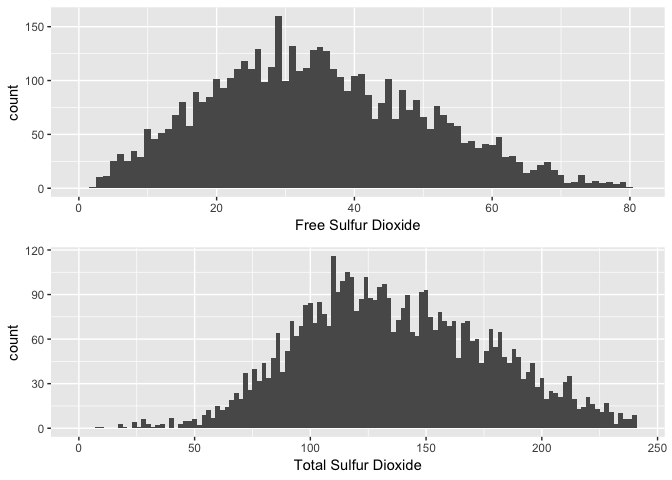 Free Sulfur Dioxide Summary:

    ##    Min. 1st Qu.  Median    Mean 3rd Qu.    Max. 
    ##    2.00   23.00   34.00   35.31   46.00  289.00

Total Sulfur Dioxide Summary:

    ##    Min. 1st Qu.  Median    Mean 3rd Qu.    Max. 
    ##     9.0   108.0   134.0   138.4   167.0   440.0

Free sulfur dioxide is the free form of SO2 that exists in equilibrium between molecular SO2 (as a dissolved gas) and bisulfite ion; it prevents microbial growth and the oxidation of wine. Both are measured in mg/dm^3.

Total sulfur dioxide the amount of free and bound forms of S02; in low concentrations, SO2 is mostly undetectable in wine, but at free SO2 concentrations over 50 ppm, SO2 becomes evident in the nose and taste of wine.

Taking a look at the max for both of them, 289.00 mg/dm^3 and 440.0 mg/dm^3, these would be considered outliters in this context compared to the rest of the summary statistics which is why they are excluded in the above plots.

Free sulfur dioxide levels are around 30 mg/dm^3 and 112 mg/dm^3 for total sulfur dioxide.

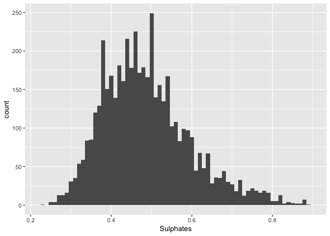

    ##    Min. 1st Qu.  Median    Mean 3rd Qu.    Max. 
    ##  0.2200  0.4100  0.4700  0.4898  0.5500  1.0800

Sulphate is a wine additive which can contribute to sulfur dioxide gas (S02) levels, wich acts as an antimicrobial and antioxidant with levels measured in g/dm^3. The bulk of wines have sulphate levels between 0.35 g/dm^3 0.55g/dm^3 with a peak count of wines having around 0.5 g/dm^3.

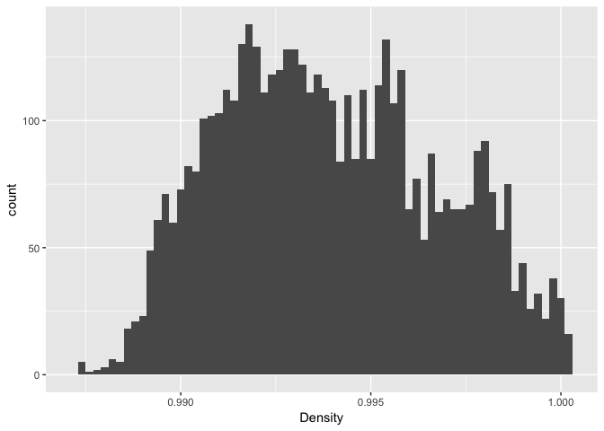

    ##    Min. 1st Qu.  Median    Mean 3rd Qu.    Max. 
    ##  0.9871  0.9917  0.9937  0.9940  0.9961  1.0390

The density of wine is close to that of water depending on the percent alcohol and sugar content, measured in g/cm^3.

For plotting a wine density histogram, I narrowed in on wines that were within the bottom 99% of of densities found. The resulting plot shows that most wines have densities around 0.9913 g/cm^3 which peaks again at a little over 0.995 g/cm^3.

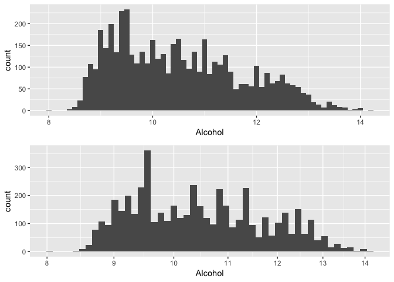

    ##    Min. 1st Qu.  Median    Mean 3rd Qu.    Max. 
    ##    8.00    9.50   10.40   10.51   11.40   14.20

Alcohol is the percent alcohol content of the wine maesured in percent by volume.

The initial plot is rather right skewed demonstrating that a trend that beyond an acohol content of 9.5%, as alcohol content goes up, fewer and fewer wines will have those alcohol concentrations. To further generalize this data, I logistically scaled down the initial plot along the x-axis. Similar to the initial plot, generally speaking we can see the same trend here with fewer wines having greater quantities of alcohol. We can also make the distinction that the peak amount of wines have an alcohol concentration of about 9.6%.

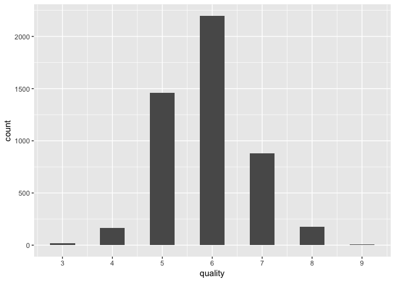

    ##    Min. 1st Qu.  Median    Mean 3rd Qu.    Max. 
    ##   3.000   5.000   6.000   5.878   6.000   9.000

    ## 
    ##    3    4    5    6    7    8    9 
    ##   20  163 1457 2198  880  175    5

At least 3 wine experts rated the quality of each wine, providing a rating between 0 (very bad) and 10 (very excellent).

This is the only discrete variable in the dataset. While scores can be as low a 0 and as high as 10 but there are no score lower than 3 and none higher than 9. I also thought it would be a good idea to get exact counts of how many wines made up each quality rating.

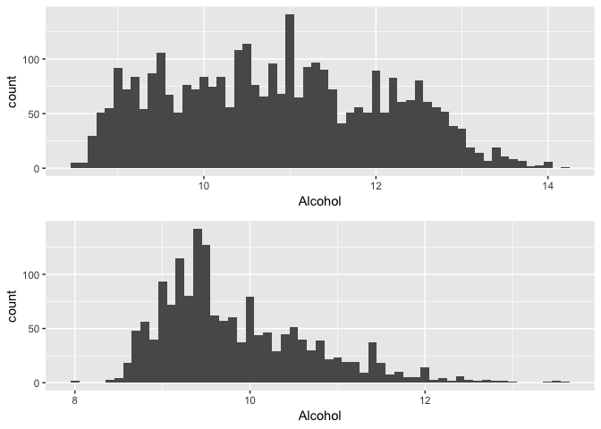

Upper Quality Wines Summary:

    ##    Min. 1st Qu.  Median    Mean 3rd Qu.    Max. 
    ##    8.50    9.80   10.80   10.85   11.90   14.20

Lower Quality Wines Summary:

    ##    Min. 1st Qu.  Median    Mean 3rd Qu.    Max. 
    ##    8.00    9.20    9.60    9.85   10.40   13.60

These two histograms show wines separated into two groups, higher quality and lower quality respectively. Lower quality wines are all wine samples with a quality score of 5 or lower and higher quality wines have a score that's higher than 5. What we can see, generally speaking, is that for higher quality wines alcohol levels vary quite consitently with the only exception being with the tails of the histrogram. Few wines have alcohol levels less than 9% and greater than 13%. As for lower quality wines, while the same holds true that not many wines have lower than 9% alcohol, we see fewer and fewer wines having an alcohol level greater than 9.5%.

Univariate Analysis
===================

### What is the structure of your dataset?

There are 4898 wine samples in the dataset with 12 features (fixed volatile acidity, citric acid , residual sugar, chlorides, free sulfur dioxide, total sulfur dioxide, density, pH, sulphates, alcohol, and quality). Quality is the only discrete variable in this dataset rated from 0 to 10 with 0 being rated the worst and ten being the best.

### What is/are the main feature(s) of interest in your dataset?

The main feature of this dataset is wine quality rating.

### What other features in the dataset do you think will help support your
investigation into your feature(s) of interest?

My focus is going to be comparing the quality rating to many of the various feature I explored in this section. While I was able to gain insight into the various features of this dataset, it felt like a birds eye veiw of the data. In the next section I will continue to focus on as many features as I can until I feel confidently make preliminary inferences.

### Did you create any new variables from existing variables in the dataset?

While I did not create any new variables I did subset the data into higher quality and lower quality wines. I then compared the alcohol levels of both subsets and found that for the higher quality wines the alcohol levels varied quite a bit while the bulk of lower quality wines had less than 10% alcohol.

### Of the features you investigated, were there any unusual distributions?
Did you perform any operations on the data to tidy, adjust, or change the form
of the data? If so, why did you do this?

For a couple of the plots I applied a log scale and for others I narrowed down the scope of the variable objects. The two variables I had applied the log scale to their respective plots were residual sugars and alcohol levels. For residual sugars, there was a very high count located on the left side of the plot which was adding a lot of noise to it. By adding the log scale I was able to demonstrate there are bi-modal with peaks around 1.2 g/dm^3 and 8g/dm^3. A similar thought process was used for alcohol levels. Unfortunately doing so did not reveal as much as was the case with residual sugar levels.

For the following variables I narrowed the scope of objects reflected in their respective plots, most of which to 99% of objects. Those variables are free sulfur dioxide, total sulfur dioxide, sulfate levels, density, chlorides and residual sugar. By doing this, the repective plots were able to better pottray general trends happening across the most of the data.

Bivariate Plots Section
=======================

    ##   fixed.acidity volatile.acidity citric.acid residual.sugar chlorides
    ## 1           7.0             0.27        0.36           20.7     0.045
    ## 2           6.3             0.30        0.34            1.6     0.049
    ## 3           8.1             0.28        0.40            6.9     0.050
    ## 4           7.2             0.23        0.32            8.5     0.058
    ## 5           7.2             0.23        0.32            8.5     0.058
    ## 6           8.1             0.28        0.40            6.9     0.050
    ##   free.sulfur.dioxide total.sulfur.dioxide density   pH sulphates alcohol
    ## 1                  45                  170  1.0010 3.00      0.45     8.8
    ## 2                  14                  132  0.9940 3.30      0.49     9.5
    ## 3                  30                   97  0.9951 3.26      0.44    10.1
    ## 4                  47                  186  0.9956 3.19      0.40     9.9
    ## 5                  47                  186  0.9956 3.19      0.40     9.9
    ## 6                  30                   97  0.9951 3.26      0.44    10.1
    ##   quality
    ## 1       6
    ## 2       6
    ## 3       6
    ## 4       6
    ## 5       6
    ## 6       6

Count of all wines by quality rating:

    ## 
    ##    3    4    5    6    7    8    9 
    ##   20  163 1457 2198  880  175    5

``` r
ggpairs(wine_data_one_index, progress = F)
```

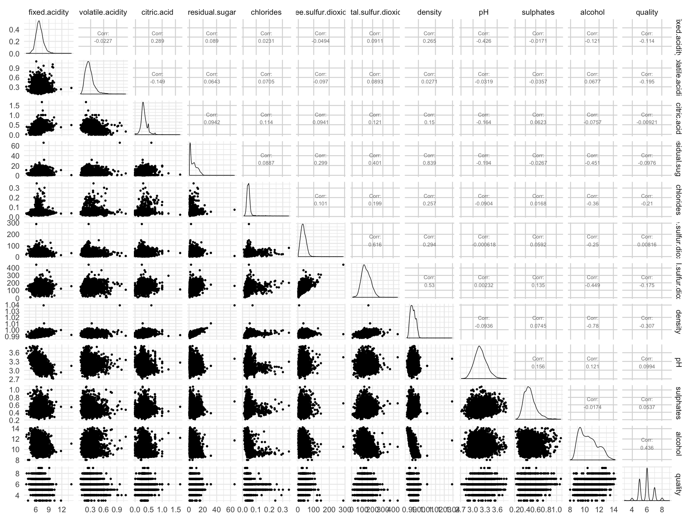

I generated this scatter plot matrix to see if I could find any interesting relationships jumped out at me. One of the ones that stuck out to me more than others is the relationship between residual sugar levels and wine density.

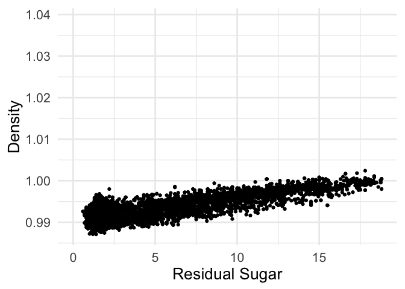

Recreating what I found in the scatter plot matrix, we see that there is a positive correlation between growing residual sugar levels and wine density. Intuitively this makes sense, the more of such a component present in the substance, in this case the more residual sugar in wine, the greater the weight or in this case the greater the density. This finding is also consistent with the corresponding correlation coefficient 0.839.

    ##  fixed.acidity    volatile.acidity  citric.acid     residual.sugar  
    ##  Min.   : 3.800   Min.   :0.0800   Min.   :0.0000   Min.   : 0.600  
    ##  1st Qu.: 6.300   1st Qu.:0.2100   1st Qu.:0.2700   1st Qu.: 1.700  
    ##  Median : 6.800   Median :0.2600   Median :0.3200   Median : 5.200  
    ##  Mean   : 6.855   Mean   :0.2782   Mean   :0.3342   Mean   : 6.391  
    ##  3rd Qu.: 7.300   3rd Qu.:0.3200   3rd Qu.:0.3900   3rd Qu.: 9.900  
    ##  Max.   :14.200   Max.   :1.1000   Max.   :1.6600   Max.   :65.800  
    ##    chlorides       free.sulfur.dioxide total.sulfur.dioxide
    ##  Min.   :0.00900   Min.   :  2.00      Min.   :  9.0       
    ##  1st Qu.:0.03600   1st Qu.: 23.00      1st Qu.:108.0       
    ##  Median :0.04300   Median : 34.00      Median :134.0       
    ##  Mean   :0.04577   Mean   : 35.31      Mean   :138.4       
    ##  3rd Qu.:0.05000   3rd Qu.: 46.00      3rd Qu.:167.0       
    ##  Max.   :0.34600   Max.   :289.00      Max.   :440.0       
    ##     density             pH          sulphates         alcohol     
    ##  Min.   :0.9871   Min.   :2.720   Min.   :0.2200   Min.   : 8.00  
    ##  1st Qu.:0.9917   1st Qu.:3.090   1st Qu.:0.4100   1st Qu.: 9.50  
    ##  Median :0.9937   Median :3.180   Median :0.4700   Median :10.40  
    ##  Mean   :0.9940   Mean   :3.188   Mean   :0.4898   Mean   :10.51  
    ##  3rd Qu.:0.9961   3rd Qu.:3.280   3rd Qu.:0.5500   3rd Qu.:11.40  
    ##  Max.   :1.0390   Max.   :3.820   Max.   :1.0800   Max.   :14.20  
    ##     quality     
    ##  Min.   :3.000  
    ##  1st Qu.:5.000  
    ##  Median :6.000  
    ##  Mean   :5.878  
    ##  3rd Qu.:6.000  
    ##  Max.   :9.000

By taking a look at the summary data for all measured components of the wines, we see that fixed acidity (tartaric acid) are present at greater median quantity than residual sugar. It makes sense to make a scatter plot of density vs fixed acidity.

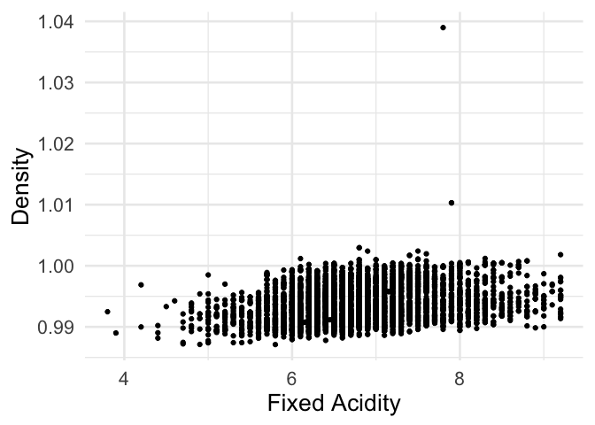

Plotting density vs. fixed acidity does show a slight correlation, though not as much as the plot for residual sugar. This is also consistent with the corresponding correlation coefficient of 0.265 obtained from the scatter plot matrix. It's also interesting to see how precise data points are plotted along the x-axis.

I now want to take a closer look at the quality of various wines vs. the various continuous variables in the dataset. The first of these plots will be taking a look at the various acidities as well as the pH.

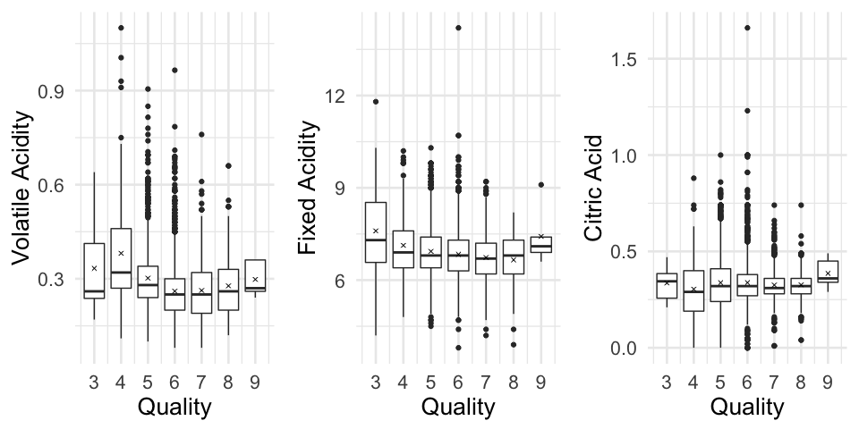

All three of the above plots show narrow interquartile ranges for wines with quality ratings of 9 with little or no outliers. Further, for both fixed acidity and citric acid both exhibit similar medians among all quality ratings.

Fixed Acidity Five Number Summary:

    ## $`3`
    ##    Min. 1st Qu.  Median    Mean 3rd Qu.    Max. 
    ##   4.200   6.575   7.300   7.600   8.525  11.800 
    ## 
    ## $`4`
    ##    Min. 1st Qu.  Median    Mean 3rd Qu.    Max. 
    ##   4.800   6.400   6.900   7.129   7.600  10.200 
    ## 
    ## $`5`
    ##    Min. 1st Qu.  Median    Mean 3rd Qu.    Max. 
    ##   4.500   6.400   6.800   6.934   7.400  10.300 
    ## 
    ## $`6`
    ##    Min. 1st Qu.  Median    Mean 3rd Qu.    Max. 
    ##   3.800   6.300   6.800   6.838   7.300  14.200 
    ## 
    ## $`7`
    ##    Min. 1st Qu.  Median    Mean 3rd Qu.    Max. 
    ##   4.200   6.200   6.700   6.735   7.200   9.200 
    ## 
    ## $`8`
    ##    Min. 1st Qu.  Median    Mean 3rd Qu.    Max. 
    ##   3.900   6.200   6.800   6.657   7.300   8.200 
    ## 
    ## $`9`
    ##    Min. 1st Qu.  Median    Mean 3rd Qu.    Max. 
    ##    6.60    6.90    7.10    7.42    7.40    9.10

Citric Acid Five Number Summary:

    ## $`3`
    ##    Min. 1st Qu.  Median    Mean 3rd Qu.    Max. 
    ##  0.2100  0.2575  0.3450  0.3360  0.3850  0.4700 
    ## 
    ## $`4`
    ##    Min. 1st Qu.  Median    Mean 3rd Qu.    Max. 
    ##  0.0000  0.1900  0.2900  0.3042  0.4000  0.8800 
    ## 
    ## $`5`
    ##    Min. 1st Qu.  Median    Mean 3rd Qu.    Max. 
    ##  0.0000  0.2400  0.3200  0.3377  0.4100  1.0000 
    ## 
    ## $`6`
    ##    Min. 1st Qu.  Median    Mean 3rd Qu.    Max. 
    ##   0.000   0.270   0.320   0.338   0.380   1.660 
    ## 
    ## $`7`
    ##    Min. 1st Qu.  Median    Mean 3rd Qu.    Max. 
    ##  0.0100  0.2800  0.3100  0.3256  0.3600  0.7400 
    ## 
    ## $`8`
    ##    Min. 1st Qu.  Median    Mean 3rd Qu.    Max. 
    ##  0.0400  0.2800  0.3200  0.3265  0.3600  0.7400 
    ## 
    ## $`9`
    ##    Min. 1st Qu.  Median    Mean 3rd Qu.    Max. 
    ##   0.290   0.340   0.360   0.386   0.450   0.490

Although acid levels remain relatively consistent across all three acid types the same cannot be said for pH levels.

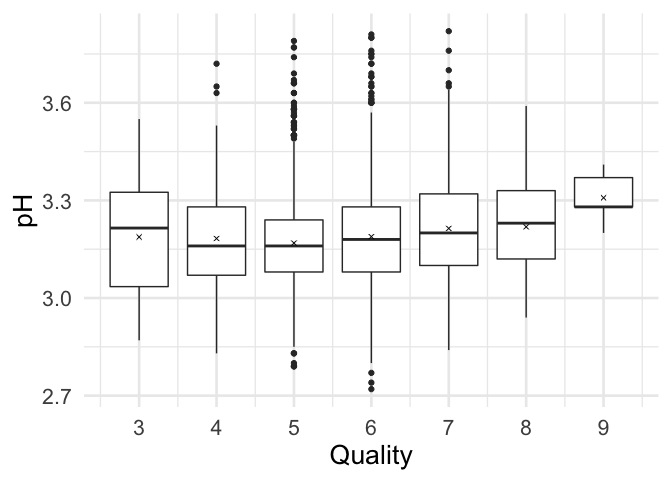

    ## $`3`
    ##    Min. 1st Qu.  Median    Mean 3rd Qu.    Max. 
    ##   2.870   3.035   3.215   3.188   3.325   3.550 
    ## 
    ## $`4`
    ##    Min. 1st Qu.  Median    Mean 3rd Qu.    Max. 
    ##   2.830   3.070   3.160   3.183   3.280   3.720 
    ## 
    ## $`5`
    ##    Min. 1st Qu.  Median    Mean 3rd Qu.    Max. 
    ##   2.790   3.080   3.160   3.169   3.240   3.790 
    ## 
    ## $`6`
    ##    Min. 1st Qu.  Median    Mean 3rd Qu.    Max. 
    ##   2.720   3.080   3.180   3.189   3.280   3.810 
    ## 
    ## $`7`
    ##    Min. 1st Qu.  Median    Mean 3rd Qu.    Max. 
    ##   2.840   3.100   3.200   3.214   3.320   3.820 
    ## 
    ## $`8`
    ##    Min. 1st Qu.  Median    Mean 3rd Qu.    Max. 
    ##   2.940   3.120   3.230   3.219   3.330   3.590 
    ## 
    ## $`9`
    ##    Min. 1st Qu.  Median    Mean 3rd Qu.    Max. 
    ##   3.200   3.280   3.280   3.308   3.370   3.410

As with the acidity levels, the pH for wines with a quality rating of 9 are found in a narrow range of values. What's interesting tough is that while the previous plots showed somewhat consistent acidity levels across all wines qualities, in the pH plot we see that the top rated wines are among the least acidic in the dataset.

Next I would like to take a closer look at sulfur and sulfate levels.

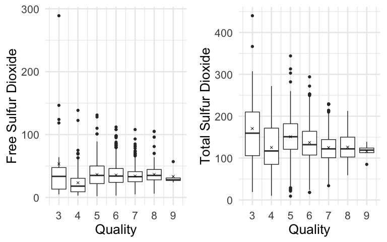 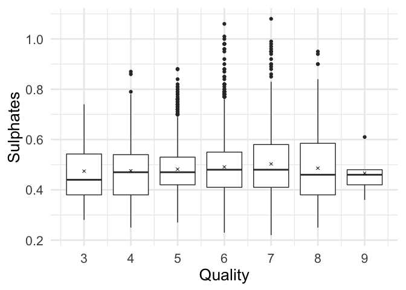

In regards to sulphate levels, medians for all quality levels in each plot seem fairly similar to each other. It is interesting to note however that when looking more carefully at the plot for total sulfur dioxide levels, the sizes of the boxes (interquartile ranges) seem to taper and get smaller as quality ratings go up. The same can be said for free sulfur dioxide but to a lesser extent.

It's interesting to see that although the interquartile range of both total sulfur dioxide and free sulfur dioxide (albeit a lesser extent) appeared to taper as wine quality increased, the same cannot be said for sulfate measurements. Intuitively I thought they would exhibit similar patterns.

Finally I grouped together the final plots of the various variables in respect to quality.

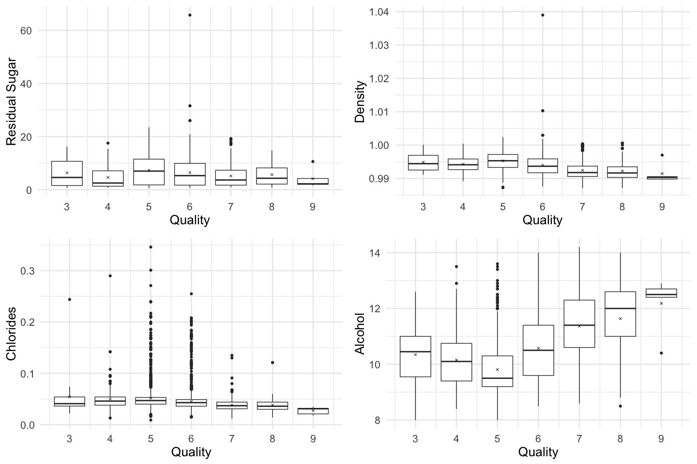

The reason that I grouped the final plots together is that, with a few exceptions, nothing particularly noteworthy is going on with them individually. However, something they all share in common is that the range and interquartile range of wines with a quality of 9 is very narrow with little to no outliers. Something else that is interesting is that with residual sugar, density, and chloride (salt) levels, their medians across all wine quality ratings are pretty similar. With density, we do see a slight correlation that suggests that higher quality wines were among those with the lowest densities. We see a somewhat similar situation when it comes to alcohol content which displays a positive correlation with wine qualities higher than four. In both instances, further investigation is necessary to come to anything conclusive.

The last thing that I noted is in regards to alcohol levels is that all of them, with the exception of 9, have rather large and varying interquartile ranges and while those that were rated 9 had a narrow interquartile range, all 5 of the top rated wines are still among the highest in terms of alcohol content.

Bivariate Analysis
==================

### Talk about some of the relationships you observed in this part of the
investigation. How did the feature(s) of interest vary with other features in
the dataset?

The higher rated wines (quality rating of 6 or greater) typically had the most amount of wines.

As noted earlier, in the case of free and total sulfur dioxide, the interquartile range seems to taper to an optimal point as wine quality increases. Also noted previously, sulfate measurements do not reflect this same quality which inherently seems odd and requires further investigation.

The highest rated wines had the lowest amount of chlorides (salts) and residual sugar and were the least dense.

The best-rated wines also had some of the highest alcohol content when comparing the median and average values of each quality rating.

### Did you observe any interesting relationships between the other features
(not the main feature(s) of interest)?

From the scatter plot matrix, the only other relationship that stood out was between residual sugar and density. The relationship indicated that the more residual sugar that was found in a wine, the denser it is. Though not to the same extent, the same could be said for the relationship between wine density and fixed acidity (tartaric acid). Although a relationship was found further investigation is necessary for both instances to establish a direct correlation.

### What was the strongest relationship you found?

It's difficult to say what was the strongest relationship I found through the bivariate analysis. Individually in terms of the main feature (wine quality) are overall pH, density, chloride (salt) levels, and alcohol content. pH and alcohol content seem to have some correlation when observing their plots, which are positively correlated while density and chloride are negatively correlated.

While I did not find particularly strong relationships between the main feature and the rest of the variables, I am able to reason that wine quality raters are looking for a combination of specific traits when it comes to highly rated wines. The reason I believe this is because, in all instances, the quality rating of 9 always had the most narrow ranges for each variable compared to the rest of the quality ratings with little to no outliers.

Multivariate Plots Section
==========================

When approaching the multivariate analysis I thought it would be a good idea to start with scatter plots from the scatter plot matrix that have relatively linear relationships. The next two scatter plot grids I take, based on the previous section, what I deem to be lesser variables among significant traits and I plotted them against, what seemed like stronger relationships in terms of wine quality, alcohol and density in two separate scatter plot grids.

    ## Loading required package: magrittr

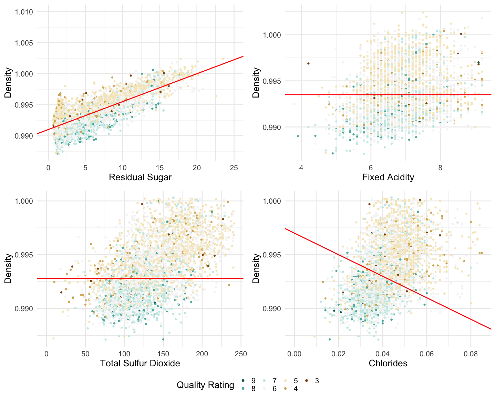

In all instances, we see that wines with lower densities consistently score higher in quality ratings with little effect of increasing amounts of chlorides, fixed acidity, total sulfur dioxide, and residual sugar.

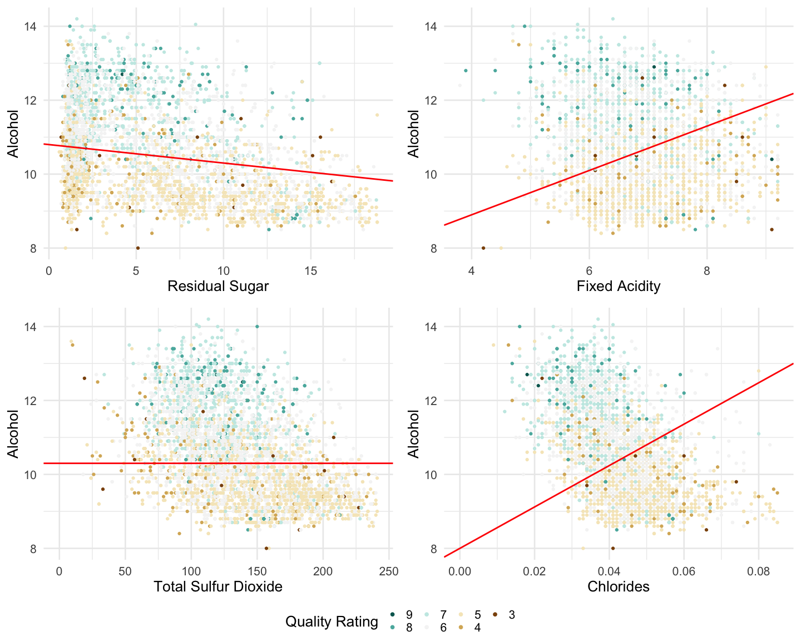

In all plots we can generally see that for the most part majority of the high quality wines appear with lesser quantites of residual sugar, fixed acidity, total sulfur dioxide, and chlorides while retaining a high alcohol content. Visually speaking all of these plots show a general trend that with an increase in the previously mentioned x-variables we see fewer and fewer highly rated wines.

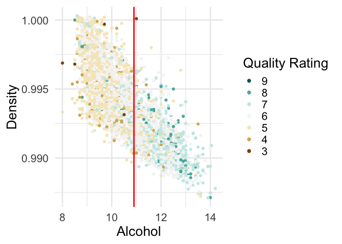

At this point, it made sense to plot, what seemed to me, to be the most relevant variables based on the bivariate analysis, alcohol, and pH. The main take away from this plot is that, for the most part, wines with high alcohol level consistently score higher quality wise than their lower alcohol content counterparts. Which also happens to some of the densest wines. Plotting density against alcohol shows the quality wines have high alcohol and low density.

Multivariate Analysis
=====================

### Talk about some of the relationships you observed in this part of the
investigation. Were there features that strengthened each other in terms of
looking at your feature(s) of interest?

My goal with this part of the analysis was to follow up on my findings in the bivariate section and see if any additional insights could be found and further elaborated on. Specifically, I'm referring to the scatter plots that were among those with the most linear relationships. To do so I took what I thought were variables that had the strongest relationships to wine quality and compare them to variables that seem to have weaker relationships with wine quality. In this case density and alcohol vs residual sugar, fixed acidity, total sulfur dioxide, and chlorides. What I found was that, generally speaking, wines that were lower in density usually scored higher than their higher density counterparts in terms of wine quality. This can also be seen with residual sugar which shows the most obvious positive correlation with density. In all plots, I drew a line separating higher and lower quality wines to my best visual estimate.

Next, I wanted to replicate the plots I previously produced for alcohol levels in place of wine density. What I found was that at lower levels of chlorides, fixed acidity, total sulfur dioxide, and residual sugar, wines with high alcohol content were among the most highly rated. With increasing amounts of the x-variable substances, fewer and fewer wines were deemed high quality.

I now felt confident enough to say that density and alcohol levels are significant contributors to wine quality determination. It only made sense to plot them against each other and observe the results. Despite containing higher levels of alcohol, the higher quality wines, for the most part, have low density.

The main take away at this point is that multiple factors affect the quality of a wine, some factors matter more than others. The leading factors found in this analysis are alcohol and wine density. It should be noted that in the case of wine density, higher quantities of substances other than alcohol that were noted to have a detrimental effect on wine quality, may have been present in those wines that have relatively high densities.

### Were there any interesting or surprising interactions between features?

I found it pretty interesting was how low the correlation coefficient between wine density and alcohol content is, the reason being is that two variables which are closely correlated should be subject to suspicion to in what sense are they related. However in this case, even though alcohol content increases, the density of most wines with higher alcohol content actually decreases. This is interesting because this could indicate that higher quality wines may have fewer quantities of the other substances observed in this dataset, especially the substances that are found in lower quantities in higher quality wines.

------------------------------------------------------------------------

Final Plots and Summary
=======================

### Plot One

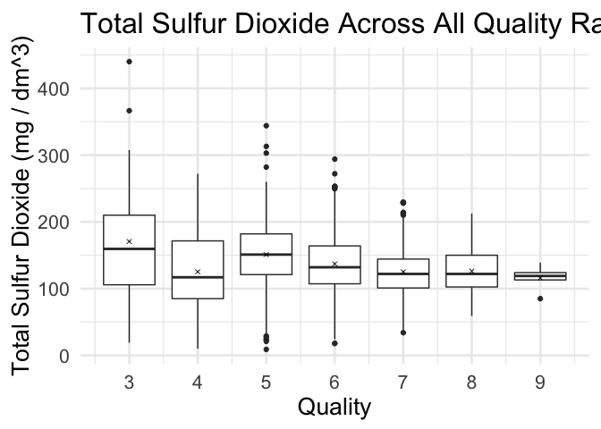

### Description One

For the first plot, I chose the box plot between total sulfur dioxide measured in wine and wine quality ratings. As stated earlier, I found it interesting how the box sizes taper in size, getting smaller as wine quality went up. This would lead me to believe that the wine experts when they were tasting wines may have been detecting a certain amount of sulfur dioxide in wines as part of their rating system. After further analysis, it is obvious that this may not be a leading factor but at the very least it may be considered when determining wine quality.

### Plot Two

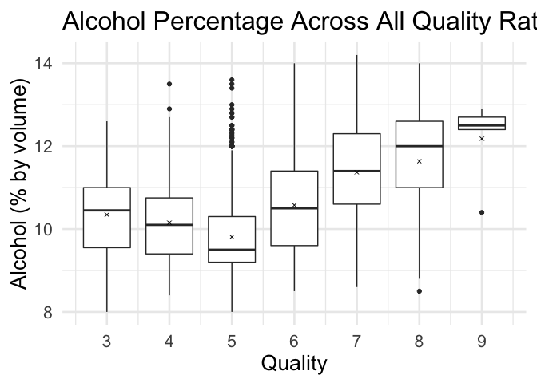

### Description Two

The highest quality wines, generally speaking, clearly have the highest levels of alcohol compared to their lower quantity counterparts. While it can't be said that the higher the alcohol content the higher the wine quality, because there are lower quality wines on this plot that have higher alcohol levels than their higher quality counterparts, compared to the other relationships observed via boxplot, this one had the strongest and most distinct.

### Plot Three

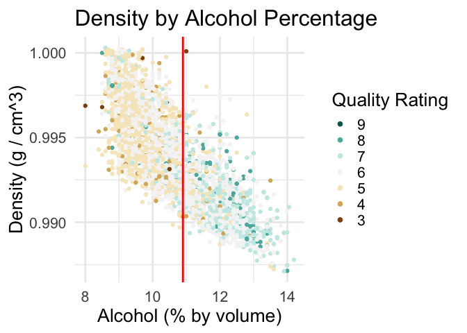

### Description Three

The analysis leading up to this plot indicated to me that density and alcohol content were among the most significant factors that lead to higher wine qualities. In this plot, we continue to see that be the case. We can distinctly see that as alcohol levels increase so does wine quality generally speaking. In the same general sense, we can also see that as wine density decreases so does wine quality.

------------------------------------------------------------------------

Reflection
==========

I began by taking a look at the structure of the data and found that there are 12 variables with nearly 5000 thousand observations. I then began by plotting each variable in a histogram to see generally how their counts were spread across all wines. This part of this analysis didn't do too much to indicate what contributed to high-quality wines but rather informed the bivariate analysis. However, a big take away from this section was that there were no wines rated less than a quality rating of 3 and higher than a quality rating of 9 and further, only 5 wines were considered the highest quality in this data set which is an important consideration when coming to anything conclusive.

Because I felt I wasn't able to gather as much insight as I would have like from the single variable analysis, I deemed it necessary to create a plot for all the variables in the dataset against the variable of interest, wine quality. I started with a scatter plot matrix which would inform my multivariate analysis quite a bit. I then proceed with various boxplots that were plotted against wine quality. What I found was that with most of them, there were subtle correlations between the various variables and wine quality, of which the most prominent I identified were total sulfur dioxide, residual sugar, density, chlorides and alcohol to be among the most significant with alcohol and then density bearing the most prominent relationship, although it should be noted that for alcohol, a trend is only obvious for quality rating of 5 and higher.

In the final section, I followed up further from my finding in the bivariate analysis by taking some of the lesser variables I found and plotting them against what appeared to me to be the most prominent variables in wine density and alcohol content and then adding a color variable which would indicate wine quality. The goal here was to see if I was overlooking the significance of any of the lesser variables and how they contribute to wine quality or if I was overestimating the significance of either density or alcohol. I found that this was not the case and an increase in the various substances in comparison to density and alcohol content resulted in the wines' quality ratings going down. It was also obvious to me that I needed to directly compare alcohol and density. What I found was that as alcohol content went up, wine quality went up and density went down. The conclusion I have come to is first, no single variable will solely help determine the quality of a wine, multiple factors have to be considered. That being said, high-quality wines seem to have high alcohol content while at the same time minimizing many of the other components identified in this dataset. The minimization of the other components may be the reason why wine density seems to be an important factor simply because intuitively speaking, the fewer components you have, the less the wine is going to weigh which then factors into the density.

Last I would like to go over the shortcomings of the dataset, and additional information that could've been gathered which may be able to improve and expand upon this analysis. First I was unable to I identify in neither the dataset nor the supporting documentation how wine quality ratings were assigned. There isn't any mention of if experts' ratings for individual wines was averaged together or if they came to a consensus together on what the rating for a wine should be. This is important because it may have shown that an expert(s) may have rated a wine lower than 3 or greater than 9. In the same line of thought, this dataset would've greatly benefited from having more wine experts on this panel. This dataset also makes no mention of any specific criteria wine experts used to determine how they rate the wines they were tasting. Other variables that could've been gathered were if additional flavors were added to the wines, as well as different processes used to create the wines and see if those variables may have also had some influence. The point is that I believe that during the data collection phase, further relevant information could have been gathered.

Citations:
==========

White Wine Dataset: <https://docs.google.com/document/d/e/2PACX-1vRmVtjQrgEPfE3VoiOrdeZ7vLPO_p3KRdb_o-z6E_YJ65tDOiXkwsDpLFKI3lUxbD6UlYtQHXvwiZKx/pub?embedded=true>

    https://s3.amazonaws.com/udacity-hosted-downloads/ud651/wineQualityWhites.csv

White Wine Dataset Supporting Documentation: \`<https://docs.google.com/document/d/e/2PACX-1vRmVtjQrgEPfE3VoiOrdeZ7vLPO_p3KRdb_o-z6E_YJ65tDOiXkwsDpLFKI3lUxbD6UlYtQHXvwiZKx/pub?embedded=true>

    https://s3.amazonaws.com/udacity-hosted-downloads/ud651/wineQualityInfo.txt

Project Skeleton: <https://s3.amazonaws.com/content.udacity-data.com/courses/ud651/diamondsExample_2016-05.html>
